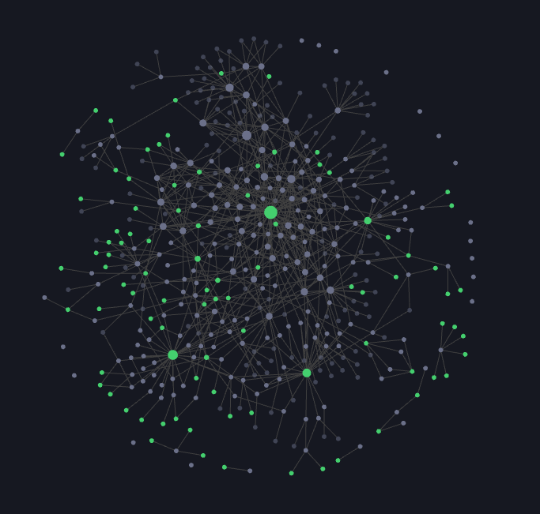

---
# Feel free to add content and custom Front Matter to this file.
# To modify the layout, see https://jekyllrb.com/docs/themes/#overriding-theme-defaults

layout: default
---

# Profile

kouki(@kmdkuk)です．  
現在、最終学歴大学院修士課程の実家済み無職です  
2024年3月まで、青のC社のNecoチームで働いてmaした．  

今もまだ、Kubernetesなどなどに興味あります。  
仕事探さNight

## SNS

### メイン

- note: [note.com/kmdkuk](https://note.com/kmdkuk)  
- Twitter: [x.com/kmdkuk](https://x.com/kmdkuk)  
- GitHub: [github.com/kmdkuk](https://github.com/kmdkuk)  

### サブ

- 旧ブログ [blog.kmdkuk.com](https://blog.kmdkuk.com/) → Jekyll + GitHub pages  
- 新ブログ [blog.kmdk.uk](https://blog.kmdk.uk/) → Next.js + Notion + Vercel  
- しずかな: [sizu.me/kmdkuk](https://sizu.me/kmdkuk)  
- Zenn: [zenn.dev/kmdkuk](https://zenn.dev/kmdkuk)  
- Qiita: [qiita.com/kmdkuk](https://qiita.com/kmdkuk)  
- BlueSky: [bsky.app/profile/kmdkuk.bsky.social](https://bsky.app/profile/kmdkuk.bsky.social)  
- Misskey: [misskey.io/@kmdkuk](https://misskey.io/@kmdkuk)  

## スキルセット・興味範囲・好きなこと

2026/01/03 更新

### Go

一番メインで書いてるプログラミング言語。  
Kubernetesのカスタムコントローラー書いたり  
CLI書いたり、ちょっとしたゲーム作ってみたり  

### Kubernetes / Docker
未だに一番興味ある分野

### typing

~~最近大西配列に入門してみた。マスターした暁には、記事書きたいなあ~~ 挫折した  
自分にあうキーボードってどんなのだろうと考える日々  
keyball, roBa, moNa, Advantage360 あたりの分割キーボードに挑戦してみたい。  
今使ってるキーボードは、HHKB・Apex Pro TKL/mini  

### memo

obsidian育て中  
  
2026/01/03現在のグラフビュー

手書きの日記とnote上で公開日記も継続中、2026/01/03現在20日超継続中！

### ゲーム

Incrementalな放置ゲーだったり  
factorio shapez 工場建築自動化ゲームだったり  
シミュレーターゲームだったり  
JRPGだったり  

FFXとP5Rと龍が如くシリーズが一番好きなゲーム

見るゲームも好きで[牛沢](https://www.youtube.com/@uszw)さんが激推です。

### Podcast / Webラジオ

耳から情報をいれるのが好きでPodcastやWebラジオちょこちょこ聞いてます。
- [ゆるふわPodcast](https://yuru28.com/)
- [茶宮公園の夜](https://www.youtube.com/@night-at-samiya)
- [pedanticのコンテンツ](https://pedantic.jp/#contents)
- [ぽこピーのゆめうつつ](https://www.youtube.com/@pokopeadreaming)
